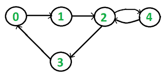

# Cycle Detection In Directed Graph

- As, we are familiar with cycle detection in directed graph 
- In, directed graph that logic won't be work.

- We need two data structure one for visited and another for backtracking.
- 
                               
                        

- Take an example above we have cycle or loop here between
    0----->1------->2------>3------->0
    and
    2---->4---->2

Dry Run:

- Using DFS we have to use to data structures one for visited nodes and another for backtracking.
    1.visited
    2.DFSvisited

- We will start form 0 as starting node
1. DFS(0)
  visited[0] = true
  Dfsvisited[0] = true
  using for loop visite for neighbours of 0. 0 --> 1 as it is directed
  call for the node 1
  DFS(1)
    - visited[1] = true
      Dfsvisited[1] = true
      visite neighbours of 1. 1 ----> 2
      DFS(2)
      - visited[2] = true
        dfsvisited[1] = true
        visited neighbours of 2 --> 3 and 2 ----> 4
        call for 3 first
        DFS(3) 
          - 3 is not visited. So, visited[3] = true
            DFSvisited[3] = true
            visited neighbours of 3 3 --> 0 
            DFS(0)
                - It is alerady visted and Dfsvisited also true 
                - That's why cycle is present 
                return true

                                